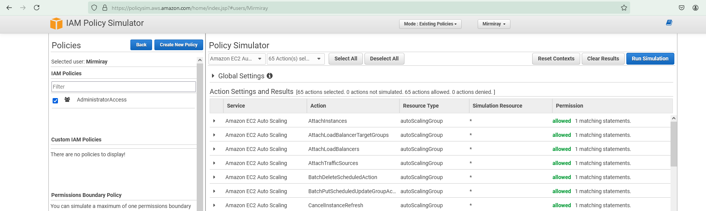
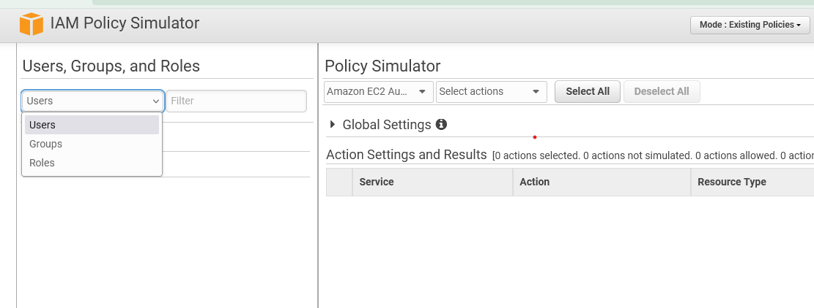
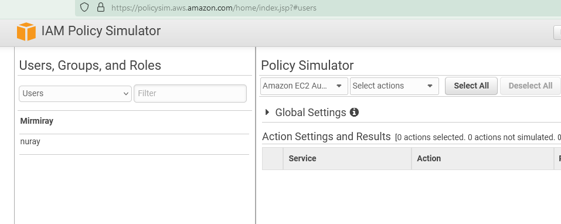
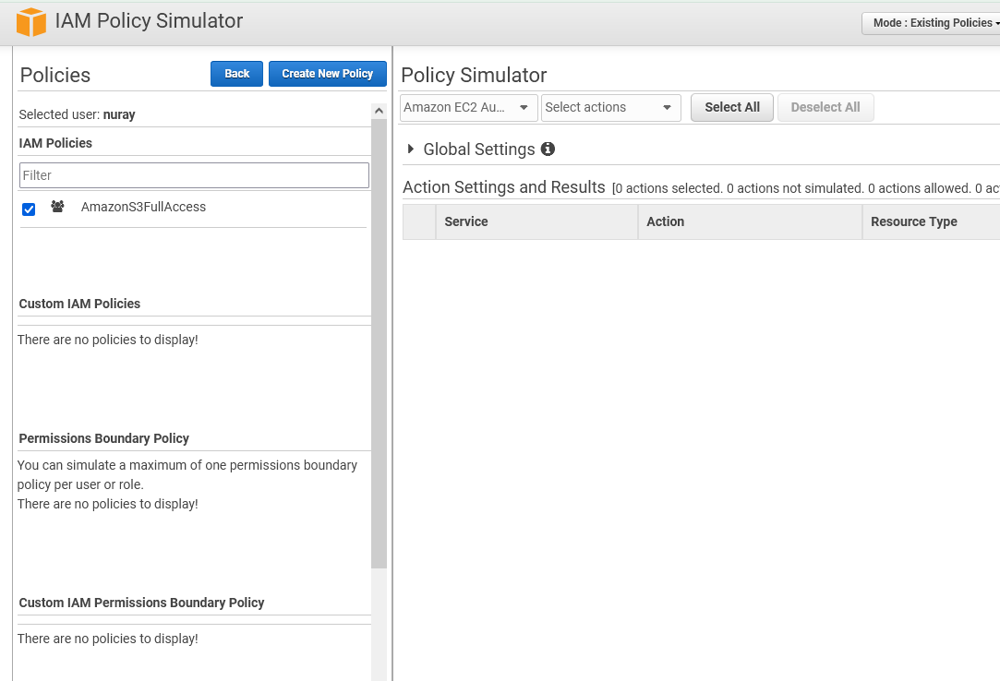
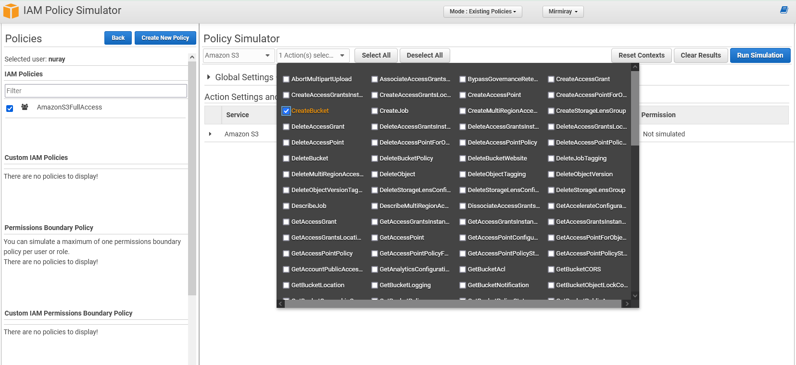
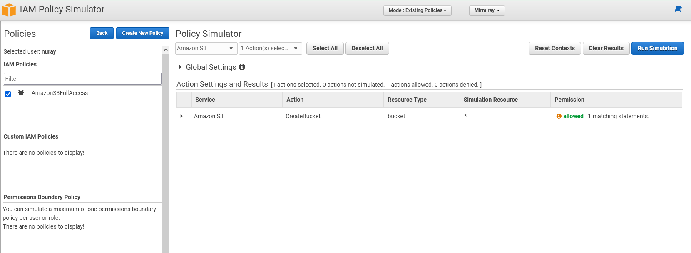

## Policy Simulator

The linkf for Policy Simulator:  

https://policysim.aws.amazon.com/  

Info for Policy Simulator:  

https://docs.aws.amazon.com/IAM/latest/UserGuide/access_policies_testing-policies.html  

--- 

---
on left hand  side we can choose between users, grouops and roles...  

---
lets choose user nuray

----
We can see the policy state of userr nuray. 

---
We can test the applice actions for specific sercive for user by selecting service and action, and then run a test simulation.   
  
---
  

***Policy Simulator is very usefaull, especially when we ant to see the results/eefects of our policy settings.***