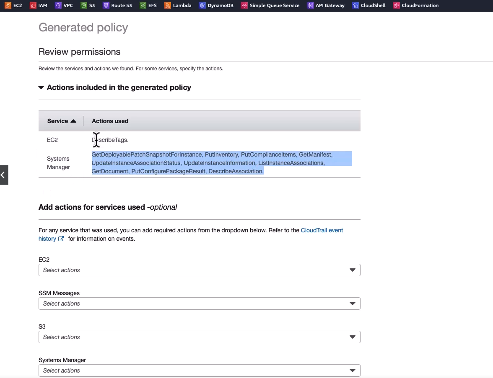

## Access Amalyzer

at first time, Access Analyzer needs to be enabled.       

We can see here some findings, 

if we clich on a findeing we ll see detailed informastion. 

So this is analyzing access and providing these findings which might warn you about potentially something that's too open, that's allowing more access than you might want it to.  

There's archive rules here about how you archive.

You can see the analyzers here as well.

You can create new analyzers.

And in the settings here you can see the access analyzer administrator and you can optionally add a

delegated administrator as well.

-----

## Credential Reports

we can dolwnload report  

it look somthing so 

Quite a bit Infor tounderstahnd how user is setted for security perspective. 

----

## Policy Simulator

## Policy Generator

ROles --> "Select a role" --> 

*at this point we see multiple policiwes appliad to this role*

*at the bottom see the button fo "Generate Poliy"*

This geremates policy based on "cloud trail" evenss. 

Steps: 
1. Choose a time frame: 

2. Choose trail

3. Specify Region

4. we can choose an existing sercive roleto generate policy

5. Clik on "Generate Ploicy

for exmple tehis is  a generated poliy:

lets view it 

in the review  we can see teh applicable actions 

after two times clicking on next, we can see the policy json  template. We can customize it through editor. 

