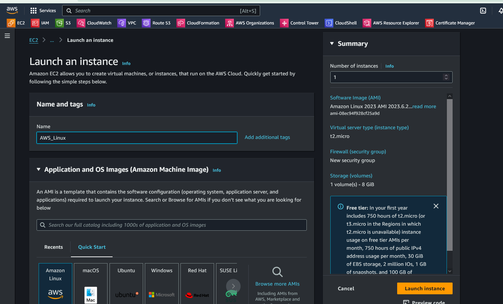

## Laundhing EC" Instance

Stepa:

1. Select an EC"-Instance Type. 

Insance Type defines the Hardware Profile costs. 

2. Selct an AMI:

AMI Defiens Os to use. Some AMIs have peer installed software on them. 

AMI s are backed by EBS Snapshots. actual data of an EC2 stored in a EBS snapshot.
Snapsot are actually taken from live instane  as a kind of backup.

 So a snapsho is a point in time backup an instnce.

 We can customize out own AMI. 

 3. EC2 --> Launch Instance -->   

   

- Name:   

 

- AMI:  

 

- Instance Type:  

  

- Keypair:  

 

- Network Setting;  

 

- Netowrk:  

- Subnet:  

- Auto Asiign IP:  

- Firewall (Security Group):  

- Configue Storage: 8GB  
- Advanced Details:  

 
    --->>> Launch Isntance 

    *We can see the informations by clicking on the instance.*

### Informations Tabs for an EC2:

 

- Details  

 

- Status and Alarm  

 

- Monitoring  

 

- Security  

 

- Networking  
 
- Storage  
 
- Tags  
 

---

## Launching Windows Server

The chritical settings here are:  

- selecht as AMI of Windows Server
   

- select always a key pair.
- set n Security Group that enable RDP.  Because connecting an Windows server is just over Remote Desktop Protocol. RDP from Port 3389
   